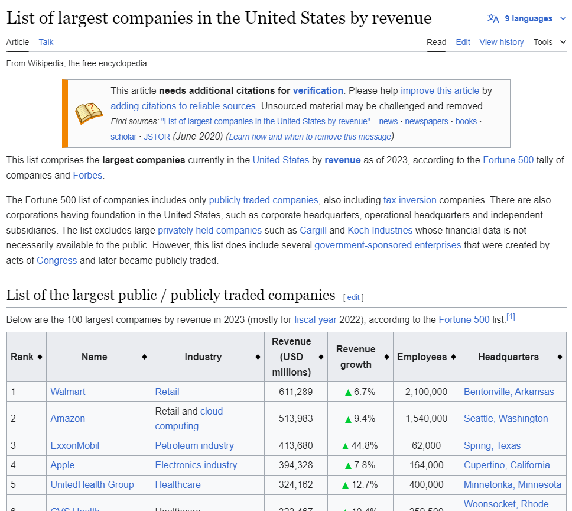

# Web_Scraping_Wiki_Large_Companies

## Introduction
In this project, we are focusing on the basic technique of web scraping in Python from BeautifulSoup (bs4) library. This project is guided by [Alex The Analyst](https://www.youtube.com/watch?v=8dTpNajxaH0&ab_channel=AlexTheAnalyst) to teach the basic technique of web scraping in a Wikipedia page of a [List of Largest Companies by Revenue](https://en.wikipedia.org/wiki/list_of_largest_companies_in_the_United_States_by_revenue). 

## Tech Stack
1. Visual Studio Code
2. Jupyter Notebook
3. Python (bs4, requests, & pandas)

## Features
This project shows a feature of how we can web scrape a Wikepedia page in Python and how we can grab a table of a list of largest companies by revenue into a dataFrame and save it as a CSV file. 

## Process
This project was guided by *Alex The Analyst*, and the Jupyter Notebook file shows the process of web scraping a Wikepedia page and finding where the table that we want to grab, so we can tranform it into a dataFrame. Near the end of the notebook, we save our dataFrame into a CSV file.
This was my first time using web scraping technique, but Alex explained very well throughout the project. I did struggle on how to read a HTML code when inspecting the Wikepedia page, for which in the Jupyter Notebook file has a code where we can find a tag that contains the table. 

## Learning
What I laern from this project was the basic technique of web scraping, and how I can use it to grab data from a website and store it into a dataFrame. While trying to grab data from a website, I learned how to inspect HTML code to identify where the table is located. 

## Running The project
Download the BeautifulSoup.ipynb file, and run it on either Jupyter Notebook, Visual Studio Code (require a Jupyter Notebook extension), and Google Colab. If you run this file, it will save a dataFrame into a CSV file, make sure to find a place to save your CSV file somewhere in your PC directory. 

